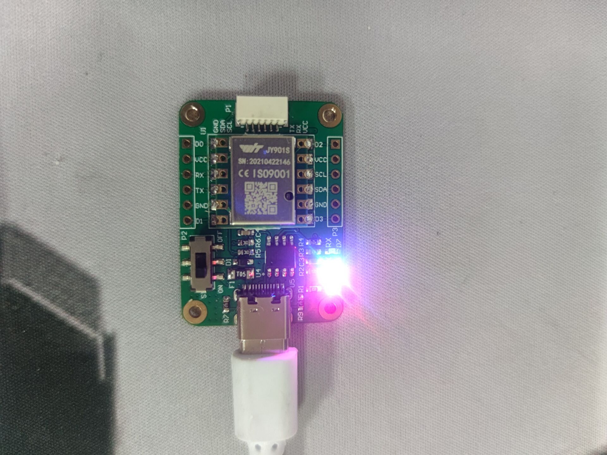
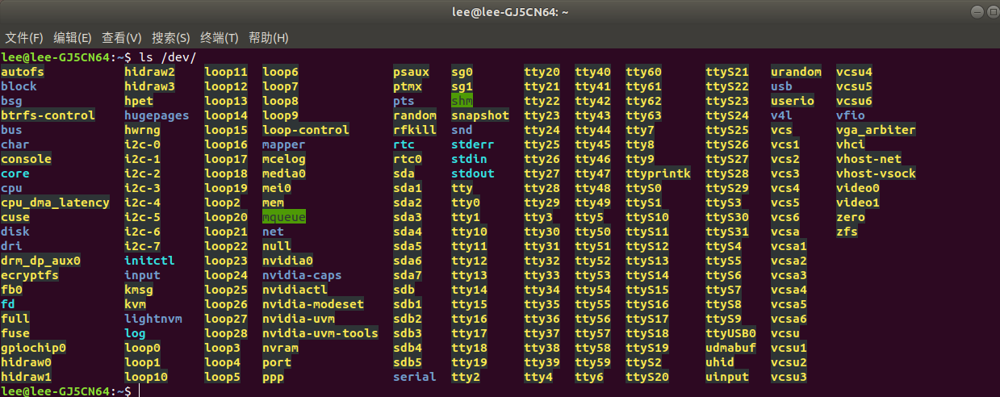
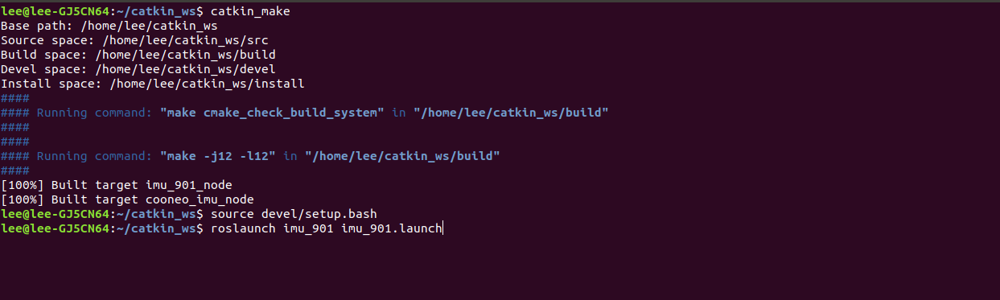
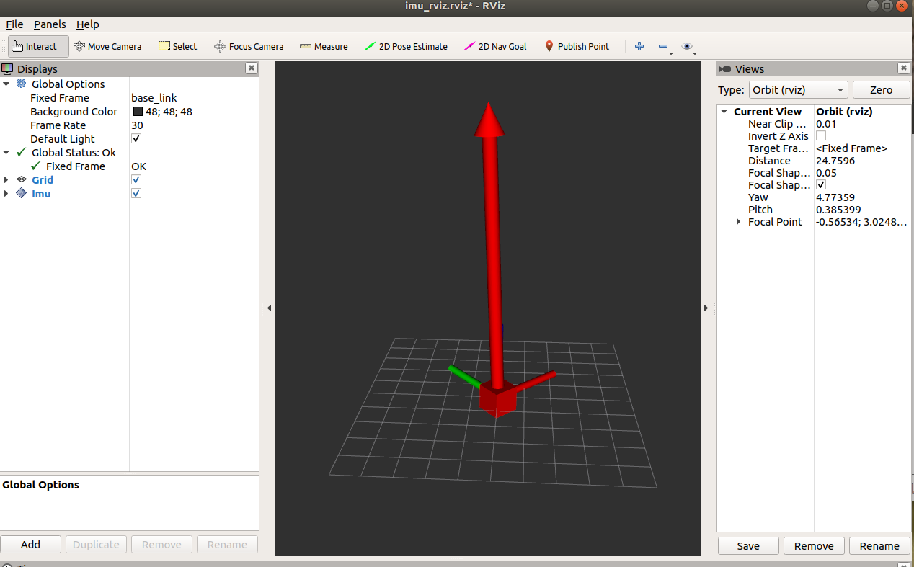
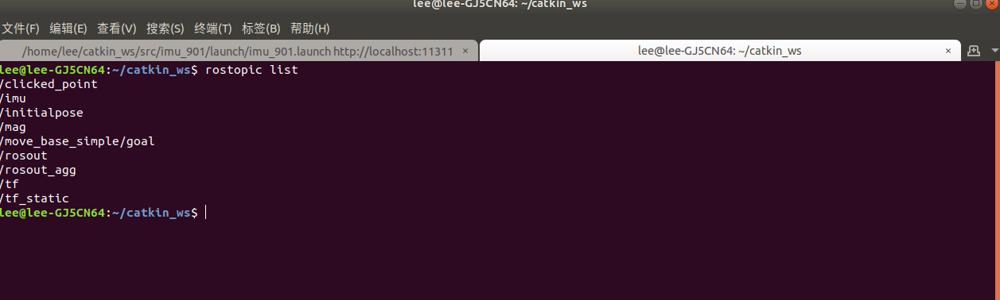

# IMU_901 ROS NODE TUTORIALS




## 一、IMU 模块配置

​	如果您是自己买的模块儿，在使用imu_901 ROS 功能包之前，需要参照“resource_folder”文件夹中的使用说明书，并借助win10上位机操作软件：“MiniIMU.exe” 对模块进行如下配置：

1、修改波特率为：115200

2、修改配置中输出项目为：加速度、角速度、角度、磁场、四元数。

3、修改配置中的输出频率为：200Hz

4、按照官网中的视频教程，利用“MiniIMU.exe”软件对模块进行校准(加速度、角度、磁场)。 

```
http://wiki.wit-motion.com/doku.php?id=jy901%E8%B5%84%E6%96%99
```


## 二、IMU_901的使用

​	新建工作空间，将imu_901功能包放入工作空间下的src文件夹下，然后在工作空间根目录打开终端，运行一键安装ROS依赖命令，为imu_901 安装 serial 等ROS依赖包：

```bash
rosdep install --from-paths src --ignore-src -r -y
```

​	然后编译，source路径：

```bash
catkin_make
source devel/setup.bash
```

​	使用USB-Type C 数据线，将电脑和imu连接起来，查看 /dev 目录下，分配的虚拟端口号(一般为：ttyUSB*)，如果只有插入了一个设备，那么一定是：ttyUSB0。如我电脑此时截图的右下角所示：



若不是 ttyUSB0,那么需要根据你的具体虚拟端口号，更改：imu_901.launch文件中的名称。

​	最后，运行，代码和过程截图如下：

```bash
roslaunch imu_901 imu_901.launch
```



 	默认会打开Rviz:



​	使用：rostopic list 可以得知 imu_901 发布的话题数据：



其中：

​	imu 是姿态信息：

​	mag 是磁力计信息；

两者都是以200Hz的频率发布的。


## 三、彩蛋

​	当有多个串口设备的时候，插拔设备后，其虚拟端口会发生变化，这里给大家提供一种端口绑定的教程(作者亲测可行)《ubuntu绑定串口设备.pdf》,按照pdf中配置完毕后，重新插拔设备，并重启即可生效。


Lee@COONEO

2021.5.28