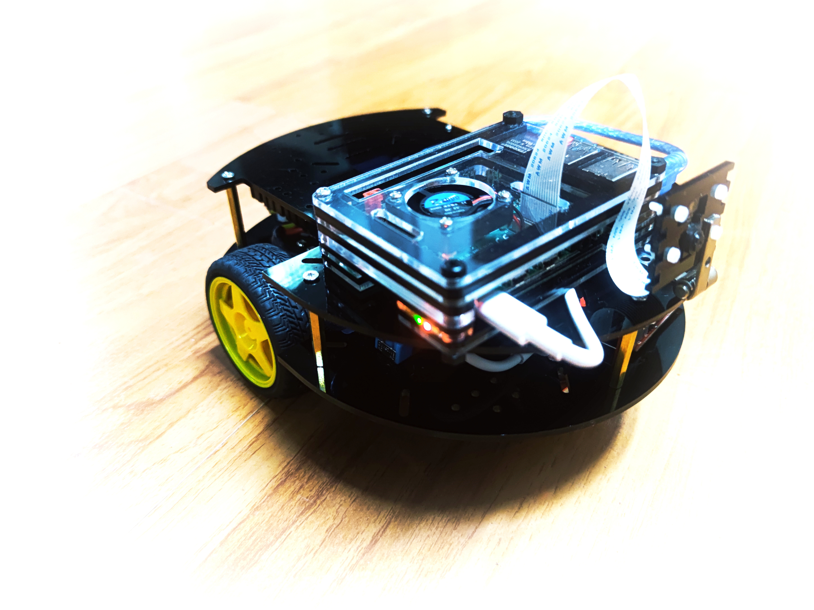

# Arduino_Raspberry_ROS_Car Tutorials


## chapter 1: Construction A ROS Car


Download codes from Git:

```bash
git clone https://github.com/COONEO/Arduino_Raspberry_ROS_Car.git
```


### Step One: Download programs for Arduino Mega 2560

Install Arduino IDE in your computer and add library where in Arduino_mega_2560_code/relative_library folder.than,download the code into your Arduino_mega_2560 board.


ps:新增了适配我们Arduino扩展板的程序，见文件夹 “**RobotPIDDriver_tb6612**”。配置过程参见如下的两篇微信公众号推文。


### Step Two: FLASH OS and LAUNCH ROS NODE

1.flash Ubuntu OS into your Pi 4B board (By Win32DiskImager.exe)

The OS img can be finding in our **Wechat Official Account COONEO.** Process like this:


2. launch ROS node in Raspberry Pi

   ```bash
   #connect Raspberry Pi and Arduino
   sudo chmod 0777 /dev/ttyACM0
   
   #open a Terminal &&  download codes
   git clone https://github.com/COONEO/Arduino_Raspberry_ROS_Car.git
   
   # copy ROS node in your home folder
   cp -r Arduino_Raspberry_ROS_car/Raspberry_Pi_ROS_Node/catkin_ws ~/
   
   # change *.py file's permission 
   sudo chmod 0777 Arduino_Raspberry_ROS_car/Raspberry_Pi_ROS_Node/catkin_ws/src/ros_arduino_bridge/ros_arduino_python/src/ros_arduino_python/*
   sudo chmod 0777 Arduino_Raspberry_ROS_car/Raspberry_Pi_ROS_Node/catkin_ws/src/ros_arduino_bridge/ros_arduino_python/nodes/arduino_node.py
   
   cd catkin_ws
   catkin_make
   source devel/setup.bash
   roslaunch ros_arduino_python arduino.launch
   ```
   
   
   
   In the end,you can publish Topic "cmd_vel" msg to control ROS car runnning。
   
   

## chapter 2:  Gmapping with Arduino_Raspnerry_Car

Step 1 : launch gmapping launch file and watching.

```bash
# open a Terminal 
cd catkin_ws
source devel/setup.bash
roslaunch launch_file gmapping_ekf.launch

# open a Rviz && Visual a map
rosrun rviz rviz
```


Step 2 : save the map 

```bash
# open a Terminal 
# cd in your folder,P.S.
cd catkin_ws/src/launch_file/map/
rosrun map_server map_saver -f your_map_name
```

​	and then,the folder will create two files,they are **your_map_name.pgm** && **your_map_name.yaml** file.


## chapter 3 : Run ROS navigation stack

Step 1 : launch navigation_ekf.launch file.

```bash
# open a Terminal
cd catkin_ws
source devel/setup.bash
roslaunch launch_file navigation_ekf.launch

# and open another Terminal
rosrun rviz rviz
```

select topics like this in Rviz.


and then,click the "2D Nav Goal" button to select a Goal pose.for details,please see the "demo_videos/03_ROS_Navigation_function.mp4" file.


## Chapter 4 : Fire detect

```bash
# open a Terminal
cd catkin_ws
source devel/setup.bash
fire_detect_cpp.launch   #or "fire_detect.launch"

# and open another Terminal
rosrun rviz rviz
```


for more details,please see the "demo_videos/04_Fire_detect_based_on_color.mp4" file. or search the "COONEO" in your Bilibili.


## chapter 5 : automatic following the line

Step 1 : launch the ros_arduino_bridge node.

```bash
# open a terminal 
cd catkin_ws
source devel/setup.bash

roslaunch ros_arduino_python arduino.launch
```


Step 2 : launch the line_track launch file.

```bash
# open another terminal 
cd catkin_ws
source devel/setup.bash
roslaunch line_track linetrack_red.launch
```


 2021.09.25

 author:ZhaoXiang Lee

COONEO Co.,Ltd

Web:[http://cooneo.cc](http://cooneo.cc/)

E: [cooneo@outlook.com](mailto:cooneo@outlook.com)

For more details,you can search "COONEO" in your WeChat.


or search "COONEO" in Bilibili.


