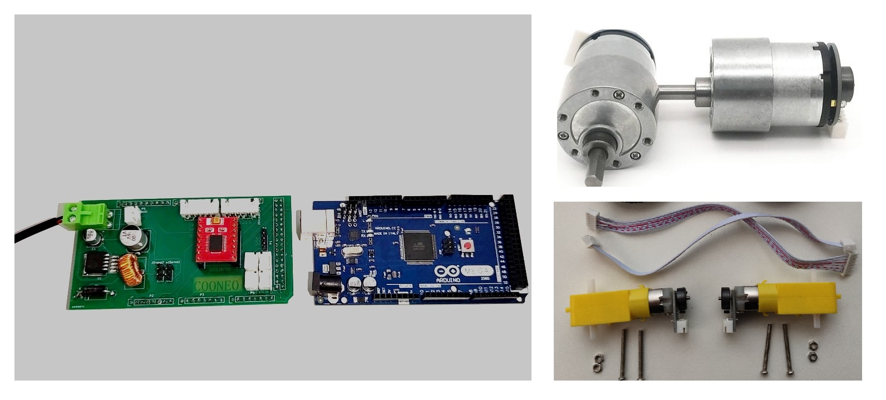

# Arduino_Raspberry_ROS_Car Tutorials


## chapter 1: Construction A ROS Car



Download codes from Git:

```bash
git clone https://github.com/COONEO/Arduino_Raspberry_ROS_Car.git
```


### Step One: Download programs for Arduino Mega 2560

Install Arduino IDE in your computer and add library where in Arduino_mega_2560_code/relative_library folder.than,download the code into your Arduino_mega_2560 board.


### Step Two: FLASH OS and LAUNCH ROS NODE

1.flash Ubuntu OS into your Pi 4B board (By Win32DiskImager.exe)

The OS img can be finding in our **Wechat Official Account COONEO.** Process like this:


2. launch ROS node in Raspberry Pi

   ```bash
   #connect Raspberry Pi and Arduino
   sudo chmod 0777 /dev/ttyACM0
   
   #open a Terminal &&  download codes
   git clone https://github.com/COONEO/Arduino_Raspberry_ROS_Car.git
   
   # copy ROS node in your home folder
   cp -r Arduino_Raspberry_ROS_car/Raspberry_Pi_ROS_Node/catkin_ws ~/
   
   # change *.py file's permission 
   sudo chmod 0777 Arduino_Raspberry_ROS_car/Raspberry_Pi_ROS_Node/catkin_ws/src/ros_arduino_bridge/ros_arduino_python/src/ros_arduino_python/*
   
   cd catkin_ws
   catkin_make
   source devel/setup.bash
   roslaunch ros_arduino_python arduino.launch
   ```

   

   In the end,you can publish Topic "cmd_vel" msg to control ROS car runnning。

   


 2021.05.31

 author:ZhaoXiang Lee

COONEO Co.,Ltd

Web:[http://cooneo.cc](http://cooneo.cc/)

E: [cooneo@outlook.com](mailto:cooneo@outlook.com)

For more details,you can search "COONEO" in your WeChat.


